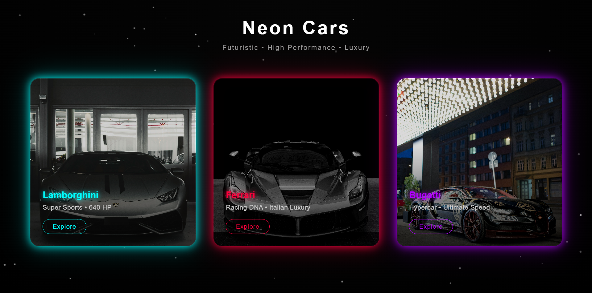

# 🚗 3D Neon Car Cards

A modern, responsive 3D neon car card UI built using **HTML, CSS, and JavaScript**.

## ✨ Features
- 3D tilt interaction
- Neon glow cards (multi-color)
- Animated neon title
- Particle background
- Fully responsive design
- No external libraries

## 🛠 Technologies Used
- HTML5
- CSS3
- JavaScript (Vanilla)

## 🌐 Live Demo
👉 https://yourusername.github.io/neon-car-cards/

## 📸 Preview

